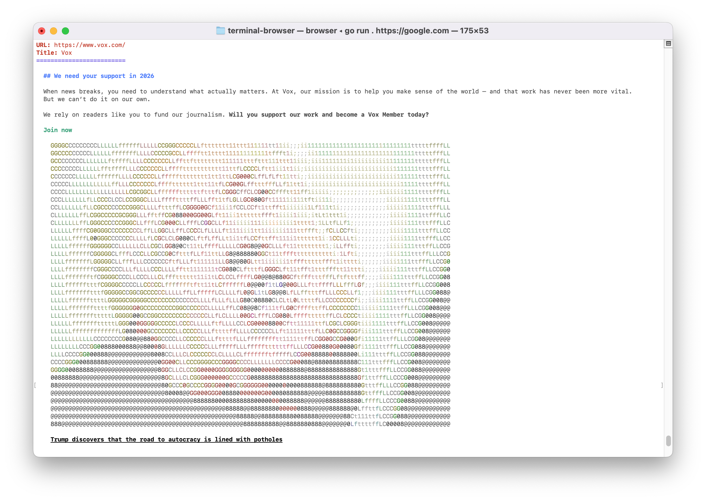
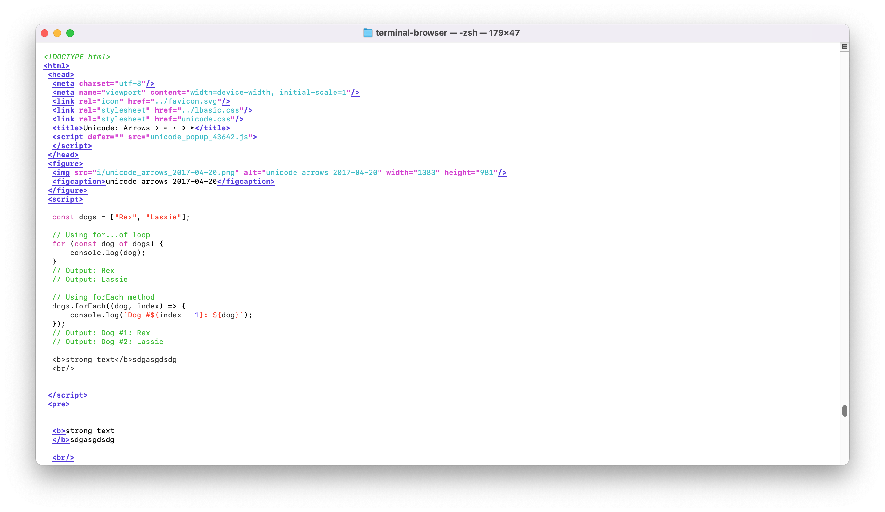

<p align="right">
⭐ &nbsp;&nbsp;<strong>the project to show your appreciation.</strong> :arrow_upper_right:
</p>

# Terminal based Web Browser

Features:
1. No Javascript support
2. Experimental Image Rendering support
3. Defaults to Reading Mode
4. Great for Reading Documentation and Newspapers
5. Formats and displays HTML (via Standard In or URL)

## Screenshot of vox.com (2026-02-14)


## Page source

You can open any file by piping the contents through standard in:

```bash
cat file.txt | browser

or

browser < input_file.html
```

Alternatively, you can pass the `--html -f` flags to a url.




## Download Pre-built binaries
https://github.com/romance-dev/browser/releases